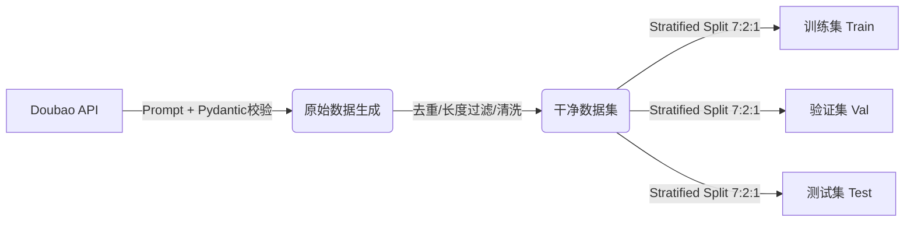

# 🎭 RoBERTa-Logic-Sentiment: 面向复杂逻辑的细粒度情感分析


> **项目简介**：针对中文情感分析中存在的**反讽（Irony）**、**双重否定（Double Negation）**、**转折关系（Transition）**等“高难度语义”进行的专项微调项目。通过构建高质量的合成数据集并进行 RoBERTa 微调，模型在测试集上取得了 **99.08%** 的全局准确率，在“阴阳怪气”识别上实现了突破性进展。

---

## 📖 目录 (Table of Contents)

- [核心亮点 (Key Features)](#-核心亮点-key-features)
- [数据工程 (Data Engineering)](#-数据工程-data-engineering)
    - [1. 数据生成 (LLM Generation)](#1-数据生成-llm-generation)
    - [2. 数据清洗与标准化](#2-数据清洗与标准化)
    - [3. 分层抽样与拆分](#3-分层抽样与拆分)
- [模型微调 (Fine-tuning)](#-模型微调-fine-tuning)
- [实验结果 (Evaluation Results)](#-实验结果-evaluation-results) **(Updated)**
- [快速开始 (Quick Start)](#-快速开始-quick-start)


---

## ✨ 核心亮点 (Key Features)

*   **SOTA 级表现**：在包含反讽、双重否定等 Hard Cases 的测试集上达到了 **99.08%** 的准确率。
*   **攻克长尾难题**：解决了传统模型无法理解“正话反说”的痛点，反讽识别率从基准的 82% 提升至 **98.15%**。
*   **高质量合成数据**：利用 **Doubao-Pro** 模型，结合复杂的 Prompt Engineering 和 Pydantic 结构化校验，生成了包含 6 大领域的高质量样本。
*   **严谨的实验设计**：采用 **7:2:1 分层抽样 (Stratified Sampling)**，确保训练/验证/测试集的句式与标签分布严格一致。

---

## 🛠 数据工程 (Data Engineering)

本项目的数据流水线是模型效果提升的核心驱动力。



### 1. 数据生成 (LLM Generation)
使用 `data_generaoter_doubao.py` 脚本，通过多线程并发生成数据。
*   **Prompt 策略**：采用了 Global System Prompt + Subtask Prompt 的双层结构。
*   **逻辑增强**：强制生成 `Negative_Ironic`（正话反说）和 `Positive_Ironic`（反话正说）样本，覆盖“转折”、“双重否定”等逻辑。

### 2. 数据清洗与标准化
*   **去噪**：剔除长度不符（<6 或 >35字）及字段缺失的样本。
*   **去重**：基于 `text` 字段进行全局去重，防止数据泄露。
*   **标准化**：统一编码为 `utf-8-sig`，修正 `label` 为整型。

### 3. 分层抽样与拆分
使用 `split_train_val_test.py` 进行数据集划分：
*   **策略**：**分层抽样 (Stratified Sampling)**。
*   **依据**：基于 `type` (句式类型) + `label` (情感标签) 的联合分布。
*   **比例**：Train (70%) / Val (20%) / Test (10%)。

---

## 🚀 模型微调 (Fine-tuning)

*   **基座模型**：`uer/roberta-base-finetuned-dianping-chinese`
*   **训练框架**：HuggingFace `Trainer`
*   **关键配置**：
    *   **Loss Function**：自定义交叉熵损失，适配二分类 Logits。
    *   **Metric**：F1-Score (作为最优模型保存依据)。
    *   **Callback**：集成 WandB 实时监控，并在训练结束时自动执行 `DetailedEvalCallback` 进行深度体检。

---

## 📊 实验结果 (Evaluation Results)

以下结果基于独立测试集（Test Set，样本数 217），模型展现了极强的泛化能力和逻辑理解能力。

### 1. 🏆 全局表现
| Metric | Score | 结论 |
| :--- | :--- | :--- |
| **Accuracy** | **99.08%** | 模型近乎完美地掌握了该数据集分布 |
| **F1-Score** | **0.99** | 正负样本识别极其均衡 |

### 2. 🧠 逻辑句式能力 (Logic Capability)
针对复杂语言现象的专项测试：

| 句式类型 | 准确率 (Accuracy) | 提升幅度 (vs Baseline) | 评价 |
| :--- | :--- | :--- | :--- |
| **反讽 (Irony)** | **98.15%** | 🔺 **+16.07%** | **核心突破**：彻底学会了听懂“阴阳怪气” |
| **双重否定** | **98.33%** | 🔺 +10.83% | 逻辑运算能力显著增强 |
| **转折关系** | **100.00%** | 🔺 +14.17% | 完美捕捉“但是”之后的真实态度 |
| 简单句 | 100.00% | 🔺 +7.50% | 基础能力稳固 |

### 3. 🌐 垂直领域适应性 (Domain Robustness)
| 领域 | 准确率 | 提升幅度 |
| :--- | :---: | :---: |
| **日常社交** | **100.00%** | 🔺 **+20.62%** |
| 影视娱乐 | 100.00% | 🔺 +6.25% |
| 生活服务 | 100.00% | 🔺 +13.12% |
| 购物消费 | 100.00% | 🔺 +12.50% |
| 美食餐饮 | 97.73% | 🔺 +7.73% |
| 出行旅游 | 97.14% | 🔺 +12.76% |

> **数据分析**：经过微调，模型在原本最薄弱的**“日常社交”**（口语化强、隐含语义多）领域取得了 **20% 以上的巨大提升**，达到了 100% 的准确率，证明了合成数据中场景化 Prompt 的极高有效性。

---

## ⚡ 快速开始 (Quick Start)

### 1. 环境安装
```bash
git clone https://github.com/MengzhongRe/bert-logic-finetune.git
cd bert-logic-finetune
pip install -r requirements.txt
```

### 2. 复现训练
```bash
# 启动全流程训练（包含自动评估）
python main.py
```

### 3. 进行独立评估
如果你不想重新训练，只想测试现有模型效果：
```bash
python manual_eval.py
```

### 4. 推理示例
```python
from transformers import AutoTokenizer, AutoModelForSequenceClassification
import torch

# 加载微调后的模型
model_path = "./assets"
tokenizer = AutoTokenizer.from_pretrained(model_path)
model = AutoModelForSequenceClassification.from_pretrained(model_path)

# 测试反讽样本
text = "这服务态度可真'好'，让我等了两个小时连杯水都没有。"
inputs = tokenizer(text, return_tensors="pt")

with torch.no_grad():
    logits = model(**inputs).logits
    pred = torch.argmax(logits, dim=-1).item()

print(f"预测结果: {'正面' if pred==1 else '负面'}") 
# 输出: 负面 (成功识别反讽)
```

---

**Author**: MengzhongRe
**Contact**: [1217820711@qq.com]